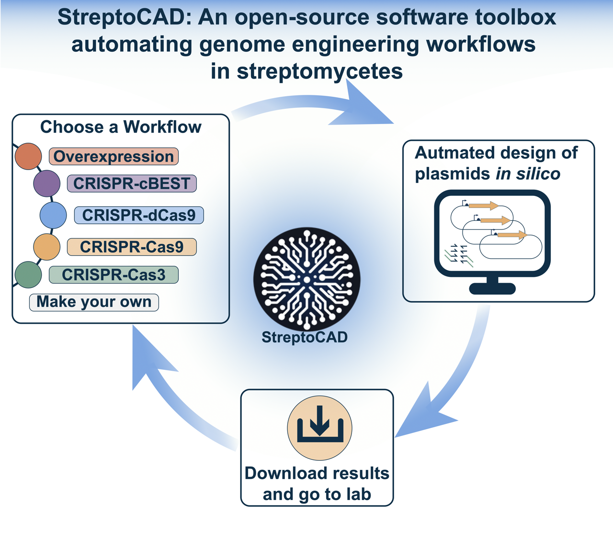

# Automate your Streptomyces genome engineering workflows 🚀


[](https://github.com/psf/black)

**StreptoCAD** is an open-source software toolbox designed to automate and streamline genome engineering in Streptomyces. This tool supports various CRISPR-based techniques and gene overexpression methods, simplifying the genetic engineering process.

You can find it here: [streptocad.bioengineering.dtu.dk](https://streptocad.bioengineering.dtu.dk)

## Features

- **Automated Primer and sgRNA Design:** Automatically generates necessary DNA primers and sgRNA sequences for your target genes.
- **Plasmid Assembly Simulation:** Simulates plasmid assemblies and the resulting genomic modifications.
- **Six Design Workflows:** Supports workflows including overexpression library construction, base-editing, and in-frame deletions using CRISPR-Cas9 and CRISPR-Cas3 systems.
- **FAIR Compliance:** Ensures data is Findable, Accessible, Interoperable, and Reusable, promoting reproducibility and ease of data management.
- **User-Friendly:** Suitable for both experienced users and beginners, facilitating collaboration and standardized workflows.

## Why StreptoCAD?

Streptomyces is a prolific source of novel bioactive molecules, but current genetic engineering methods are inefficient and time-consuming. StreptoCAD addresses these challenges by automating the design process, reducing errors, and speeding up the development of genetically modified strains. This tool transforms complex genetic engineering tasks into straightforward, reproducible processes, enabling faster scientific advancements and discovery of new natural products.

For more details and an in-depth discussion of our approach, check out our [bioXiv paper](https://www.biorxiv.org/content/10.1101/2024.12.19.629370v1.full).

## Workflows



StreptoCAD offers six distinct workflows for various genetic engineering tasks:

1. **[Overexpression Plasmid Library Construction](notebooks/app_workflows/W1_overexpression_workflow.ipynb):**

   - Can be used to overexpress target proteins - we experimentally validated this by overexpressing regulators.

2. **[Single CRISPR-BEST Plasmid Generation](notebooks/app_workflows/W2_CRISPR-BEST-single.ipynb):**

   - Base editing system in the genome of Streptomyces using single sgRNA for targeting.

3. **[Multiplexed CRISPR-BEST Plasmid Generation](notebooks/app_workflows/W3_multiplexed_CRISPR-BEST.ipynb):**

   - Multiplexed base-editing in the genome for high-throughput genetic studies.

4. **[CRISPRi Plasmid Generation](notebooks/app_workflows/W4_CRISPRi.ipynb):**

   - Uses transcriptional interference to reversibly inactivate genes for functional studies.

5. **[CRISPR-Cas9](notebooks/app_workflows/W5_CRISPR-cas9-inframe-deletion_random_sized_deletion.ipynb):**

   - Can be used for random-sized or in-frame deletions with Cas9

6. **[CRISPR-Cas3](notebooks/app_workflows/W6_CRISPR-cas3-inframe-deletion_random_sized_deletion.ipynb):**
   - Can be used for random-sized or in-frame deletions with Cas3

## Experimental Validation

StreptoCAD's efficiency and user-friendliness were validated by designing and constructing overexpression strains in Streptomyces Göe40/10 in just eight weeks. This highlights the tool's capability to accelerate genome engineering projects.

## Future Developments

Future expansions will include additional genome engineering tools and integration with laboratory robotics systems for end-to-end automation, further enhancing the capabilities and efficiency of StreptoCAD.

## Get Started

Visit [www.streptocad.bioengineering.dtu.dk](www.streptocad.bioengineering.dtu.dk) to try StreptoCAD, access documentation, and join the community of users and contributors working to advance Streptomyces research.

## Want to run StreptoCAD locally?

#### 1. Set up a Conda virtual environment (Why it's smart)

Using a Conda virtual environment is a great way to manage dependencies for your project. Conda makes it easy to create and manage isolated environments, ensuring your project’s libraries are kept separate from other projects and system-wide dependencies. This helps avoid compatibility issues and makes it simpler to reproduce your development environment.

To create a new Conda environment, run:

```bash
conda create --name streptocad python=3.11
```

Replace streptocad with your preferred environment name, and replace 3.11 with the specific version of Python you need.

Then activate it:

```bash
conda activate streptocad
```

#### 2. Install the requirements

Once your Conda environment is active, you can install the required dependencies from requirements.txt. This ensures your environment has all the necessary packages for the project. Use the following command:

```bash
pip install -r requirements.txt
```

(Note: Even though you're using Conda, pip is still used to install from requirements.txt.)

#### 3. Run the application

Finally, to run the StreptoCAD application, execute the following command:

```bash
python3 application.py
```

This will launch the application locally, and you're ready to go! Follow the url that your terminal shows.

Alternatively, you can try running the workflows as Jupyter notebooks after completing the installation above.

## Running the StreptoCAD App via Docker

To run the StreptoCAD application using Docker, follow these steps:

### 1. Build the Docker Image

First, build the Docker image from the `Dockerfile` located in the root of the project:

```bash
docker build -t streptocad .
```

### 2. Run the Docker Container

Once the image is built, run the container:

```bash
docker run -d -p 8050:8050 streptocad
```

This will start the StreptoCAD application, exposing it on port 8050 of your local machine.

### 3. Run the application

Finally, to run the StreptoCAD application, execute the following command:

```bash
python3 application.py
```

This will launch the application locally, and you're ready to go! Follow the URL that your terminal shows.

## Making Your Own Workflow

StreptoCAD is designed to be modular and user-extensible. We’ve created a **comprehensive guide** to help you add your own custom workflows to the application. This guide covers:

- Creating new frontend components (tabs)
- Developing backend callback functions
- Writing tests
- Integrating your changes into the main app via GitHub

You can find the step-by-step guide here:

👉 [**Integrating New Workflows into StreptoCAD**](https://github.com/hiyama341/streptocad/blob/main/web_app/how_to_make_your_own_workflows.md)

Whether you want to adapt StreptoCAD for your research needs or contribute to the community, this documentation walks you through every stage of the process, including code examples and best practices.

**If you need help:**

- Check out the additional resources and documentation in the [docs folder](https://github.com/hiyama341/streptocad/tree/main/docs).
- Open an issue on GitHub or contact the development team.

We encourage all users to contribute and help make StreptoCAD even more powerful and versatile!

## License

StreptoCAD is open-source and licensed under the MIT License.

## Contact

For questions or contributions, please contact [luclev@dtu.dk](mailto:luclev@dtu.dk).
